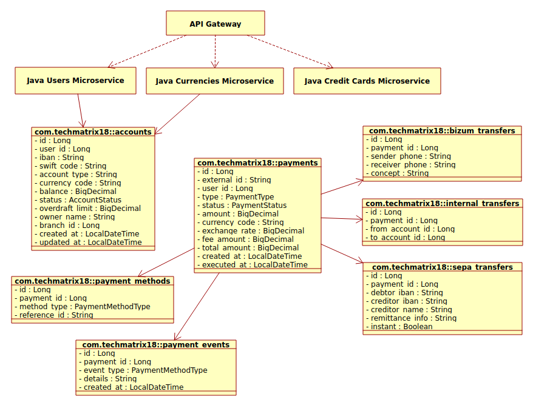

# Java Payments Microservice

    

     
    
    
    

### Overview

This Java-based microservice is designed to manage credit card information, providing functionalities such as creating,
retrieving, updating, and deleting credit card records. It leverages Spring Boot for rapid development and ease of deployment.
Uses **WebFlux** and supports asynchronous operations for improved responsiveness.

This microservice is part of a larger ecosystem that includes other microservices like Auth/User Microservice, 
Credit Cards Microservice and Monitoring Microservice.

### Features

- **CRUD Operations**: Create, Read, Update, and Delete credit card records and other entities.
- **RESTful API**: Exposes endpoints for easy integration with other services and microservices.
- **Data Validation**: Ensures that credit card data is valid before processing.
- **Error Handling**: Provides meaningful error messages for invalid operations.
- **Logging**: Implements logging for monitoring and debugging purposes.
- **Database Integration**: Connects to a relational database for persistent storage of credit card data.
- **Security**: Implements basic security measures to protect sensitive credit card information.
- **Testing**: Includes unit and integration tests to ensure reliability and correctness.
- **Documentation**: Comprehensive API documentation for developers.
- **Containerization**: Docker support for easy deployment in various environments.
- **Scalability**: Designed to handle increasing loads with ease.
- **Configuration Management**: Externalized configuration for flexibility across different environments.
- **Monitoring**: Integrates with monitoring tools to track performance and health.
- **Versioning**: API versioning to manage changes and updates effectively.
- **Compliance**: Adheres to industry standards for handling credit card information.
- **Extensibility**: Modular design to facilitate future enhancements and feature additions.
- **User Authentication**: Integrates with authentication microservice to secure access to microservice of credit card.
- **Asynchronous Processing**: Uses WebFlux and supports asynchronous operations for improved responsiveness.
- **Rate Limiting**: Protects the microservice from abuse by limiting the number of requests from clients.

### Technologies Used
- Java
- Spring Boot
- Spring REST
- Spring Security
- Spring WebFlux
- Spring Data JPA
- Spring R2DBC
- Spring Boot Actuator
- RabbitMQ/Kafka
- Resilience4j
- Hibernate
- PostgreSQL
- Flyway
- JWT
- JUnit
- Mockito
- Maven
- Swagger/OpenAPI
- Logback/SLF4J
- Micrometer
- Prometheus/Grafana
- Docker
- Spring Cloud Gateway

### Getting Started
#### Prerequisites
- Java Development Kit (JDK) 17 or higher
- Maven 4.0 or higher
- PostgreSQL database (docker container is recommended)
- RabbitMQ/Kafka server (docker container is recommended)
- Docker (optional, for containerization)
- Git
- IDE (e.g., IntelliJ IDEA, Eclipse)
- cURL or Postman for API testing
- Monitoring tools (Prometheus, Grafana)

